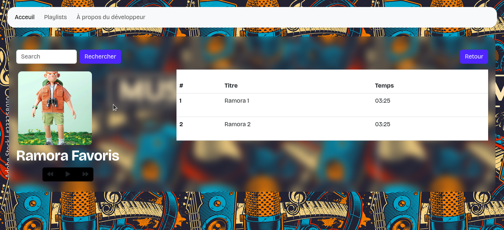

### Projet SESAME

> INSTALLATION

+ ouvrir un terminal (Ctrl + Alt + T)
+ copiez et collez, et presser la touche <b>Enter</b>
```
$ 

```
Il se peut que [github](https://github.com) te demande de d'authenfier sous terminal.
+ S'il te demande un ```username```, on lui donne l'username github (~dylanyoko~ par exemple)
+ Ensuite, le password, <b>tu ne mets pas ton mot de passe de connexion github, soit tu lui passes un access token, tu créeras suivant cette tutoriel([cliquer ici](https://docs.github.com/en/authentication/keeping-your-account-and-data-secure/managing-your-personal-access-tokens#creating-a-personal-access-token-classic)) si tu n'as pas un access token préengistrer en ta possession actuelle, ou si celle-ci se venait à expirer</b>

> LANCEMENT

Ouvrir fichier sur un navigateur ```index.html```

### ARTISTES

<b>Card</b>


1) Allez dans le fichier ```./pages/playlist.html```

2) Copier ceci

```
<div class="card">
    <div class="card__img">
        
    </div>
    <div class="card__desc">
        <h3 class="text-center card__name">Ramora Favoris</h3>
            <a href="./artists/ramora-favoris.html" class="w-100 btn btn-primary text-center">
                Voir
            </a>
    </div>
</div>
```
3) Trouver le div avec la classe ```playlist```, ligne 59
4) Collez tout au base de la liste des card

5) Modification data
+ modifier l'<b>image</b> : modifier l'url de l'attribut ```src``` sur le tag ```img```
```
<!-- changer "../assets/img/explorer.jpg" par le lien relatif vers l'image de l'artiste -->

<div class="card__img">
    
</div>
```

+ modifier le <b>nom de l'artiste</b> : modifier le texte entre le tag ```h3``` avec la classe ```card__name```
```
<!-- changer "Ramoras Favoris" par le nom de l'artiste -->

<h3 class="text-center card__name">Ramora Favoris</h3>
```

+ préciser le <b>lien de redirection</b> (le fichier html à afficher qu'on clique sur le <i>bouton <b>voir</b></i>).
Pour le faire, modifier le texte de l'attribut ```href``` du tag ```a```
```
<!-- changer "./artists/ramoras-favoris.html par le fichier html qui afficher la playlist de l'artiste ici" -->

<a href="./artists/ramora-favoris.html" class="w-100 btn btn-primary text-center">
    Voir
</a>
```

<b>N.B : Pour 1 card artiste, ce card doit avoir un fichier html spécifique à lui, qui liste ses propres playlists.</b>
Créer ce fichier dans le dossier ```pages/artists```
Il est préferrable de donner le même nom de fichier au même nom d'artiste. 
Comme par exemple, ```ramora favoris```, nommez-le fichier propre à lui ```ramors-favoris.html```

### LISTE DES PLAYLISTS



> <b>N.B</b> :```ramos-favoris.html``` est un fichier des listes de playlist

> les fichiers liste des playlists se trouve ```pages/artists```

Pour <b>un card</b> doit avoir <b>un fichier liste des playlists</b> dans ```pages/artists```

> Dans le dossier ```pages/artists```, il y a un fichier ```layout.html```

À chaque fois que vous créer un fichier liste des playlists, copier les tous codes dans le fichier ```layout.html``` et coller dans le nouveau fichier.
Et voici les choses à dynamiser :
> A noter que le nom de l'artiste et l'image de l'artiste doit-être de même que sur le card lié à celle-ci
+ le nom de l'artiste
+ l'image de l'artiste
+ Le tableau des playlists (chaque <b>titre</b> des musiques, <b>durée</b> de chaque musique) à modifier ses choses pour chaque item du tableau
+ La liste des musiques en back-end.

<b>Le nom de l'artiste</b>
Fouillez au tour de la ligne 75 et trouver ce code
```
<!-- changer le "Nom de l'artiste" Par le vrai nom de l'artiste -->

<h1 class="text-bolder text-white">
    Nom de l'artiste
</h1>
```
<b>L'image de l'artiste</b>
Fouillez autour de la ligne 75 et trouver ce code.
> <b>N.B</b> : Ce codebase se trouve tout au dessus du nom de l'artiste précedemment vu
```
<!-- changer "../../assets/img/explorer.jpg" par le chemin relatif vers le vrai image de l'artiste -->

<div class="artist__img">
    
</div>
```

<b>Le tableau des playlists et la liste des musiques en backend</b>
> <b>N.B</b> : Le nombre de musique dans le tableau <b>doit être identique</b> au nombre des listes des musiques en backend(dans l'array ```audioSources``` javascript)

+ <b>La liste des musiques en javascript</b>

Fouillez autour de la ligne 154, et trouvez ce variable ```audioSources```
```
const audioSources = [
    `${sourcePath}/music-1.mp3`,
    `${sourcePath}/music-2.mp3`,
]
```
> La fichier ```.mp3``` doît obligatoirement se trouver dans le dossier ```assets/media```. Chaque music que tu importeras, tu le mettras dans ce dossier.

<b>N.B</b> : ```music-1.mp3``` et ```music-2.mp3``` se trouve donc dans ```assets/media```

+ <b>L'ordre</b> des mp3 dans le tableau <b>compte</b>
+ Si on a mis ici 2 musiques(```music-1.mp3```, ```music-2.mp3```), le tableau doit avoir des listes de titre de musiques en nombre de 2, et dans l'ordre comme dans cette array ```audioSources```

---

+ <b>Le tableau des playlists en front-end</b>

Fouillez autour de la ligne 104, et vous y trouvez un commentaire de code comme celle-ci:
```
<!-- à dupliquer -->
    <tr>
        <th scope="row">1</th>
        <td>
            <div class="d-flex gap-2">
                <div>Titre musique</div>
                <div class="sound-track track--1 d-none">
                    
                </div>
            </div>
        </td>
        <td>03:25</td>
    </tr>
<!-- fin à dupliquer -->
```
Un code comme celle-ci veut dire une ligne de musique. Donc pour 2 listes de musique, tu dois copiez-coller ce code jusqu'à avoir 2 comme celle-ci. Et modifier pour chacune:
+ Le titre du musique dans
```
<!-- changer "Titre musique" par le titre titre de la musique -->

<div>Titre musique</div>
```

+ La durée de la musique dans
```
<!-- changer "03:25" par le vrai durée de la musique -->

<td>03:25</td>
```
+ L'index(identifiant) de la musique

Vous devez voir ce ligne de code
```
<div class="sound-track track--1 d-none">
    ...
</div>
```
<b><i>
"sound track track--1" pour la musique à la ligne 1.

La musique à la ligne 2, doit être "sound track track--2"
...
Ainsi de suite, jusqu'à la dernière ligne(dernière musique) du tableau. "track--{nombre}" doit être variable à l'ordre de suite de musique du tableau.
</i></b>
> nombre = place de la musique dans tableau(voir la musique se trouve à la ```nombre```~ième~)

<div align="center">
    Et c'est tout :smile: :fire: :fire: 
</div>

> À ne pas oublier que l'ordre ici compte, l'ordre des musiques(et le nombre) dans le tableau front-end doit $etre égale que au nombre la listes des array mp3 dans le variable ```audioSources``` en javascript, et dans même l'ordre.

